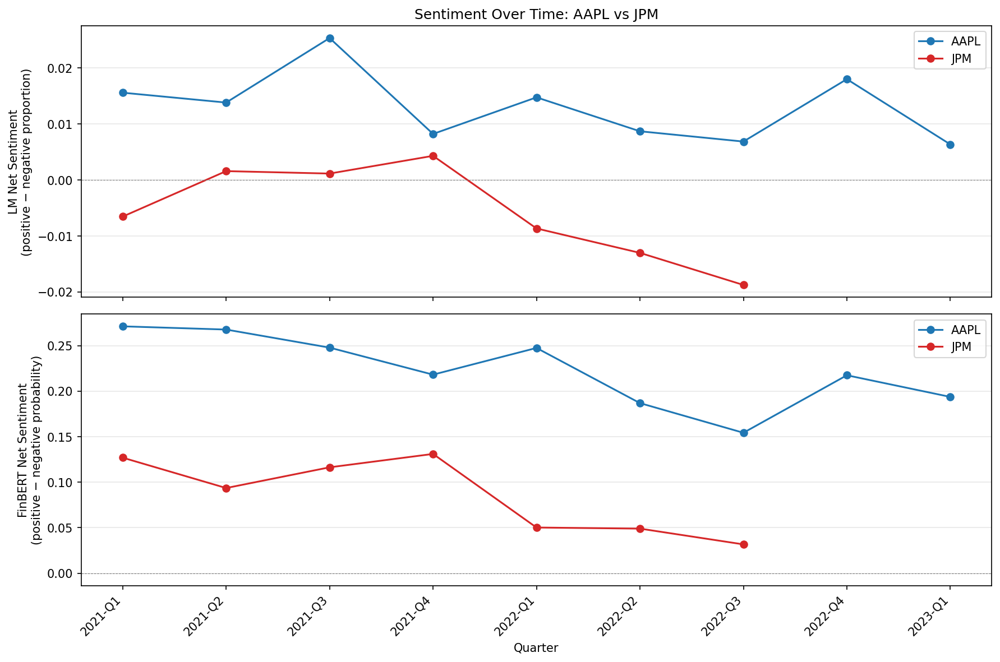
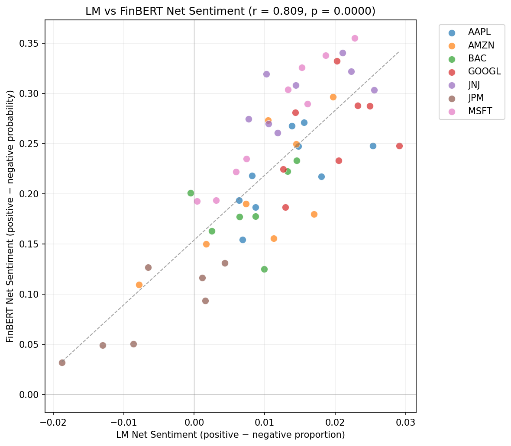
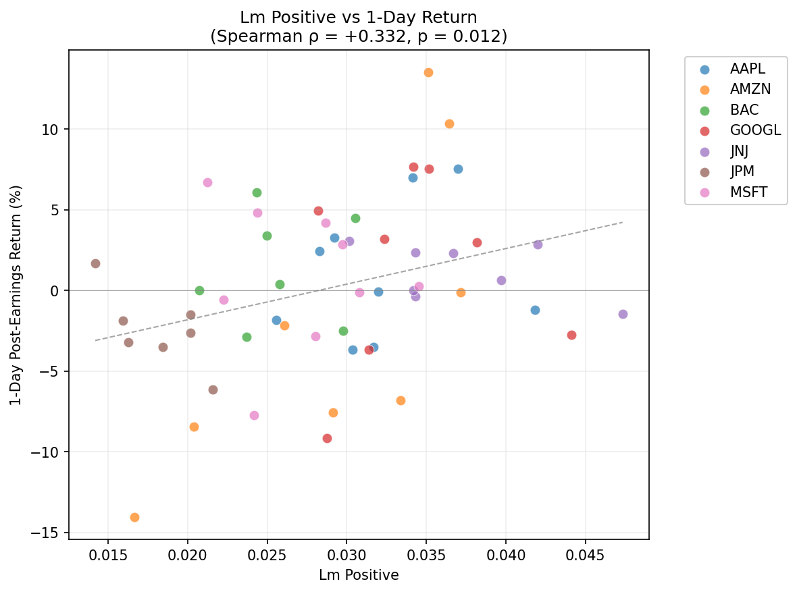

# Earnings Call Sentiment Analysis

NLP pipeline that scores 56 earnings call transcripts from 7 large-cap companies (AAPL, MSFT, AMZN, GOOGL, JPM, JNJ, BAC) using two complementary methods, then tests whether transcript sentiment correlates with short-term post-earnings stock returns. Built as a portfolio project demonstrating end-to-end NLP applied to finance.

## Key Findings

The Loughran-McDonald dictionary and FinBERT agree strongly on transcript-level sentiment (r = 0.81), confirming the signal is robust across methods. Both show a modest correlation with 1-day post-earnings returns (Spearman rho around +0.3, p < 0.05) that disappears entirely by the 5-day horizon. However, none of the results survive multiple comparison correction, and n = 56 is small. The honest conclusion: there may be a faint, short-lived signal, but it's far too weak to be actionable for large-cap equities where information is priced in almost instantly.







## Approach

1. **Data collection** — Transcripts from Kaggle (Motley Fool), prices from yfinance. Q1 2021 through Q2 2023.
2. **Preprocessing** — Strip boilerplate (operator greetings, footers, metadata), segment into prepared remarks and Q&A.
3. **Sentiment scoring** — Loughran-McDonald dictionary (word-level proportions across 5 categories) and ProsusAI/FinBERT (sentence-level transformer, mean-aggregated to transcript level).
4. **Correlation analysis** — Spearman rank correlations between 10 sentiment features and 1-day/5-day returns, with pre-market vs after-hours timing handled correctly.

## Run It Yourself

```bash
# 1. Clone and set up
git clone https://github.com/rj694/earnings-sentiment.git && cd earnings-sentiment
python -m venv .venv && source .venv/bin/activate
pip install -r requirements.txt

# 2. Get the transcript data from Kaggle
# Download: https://www.kaggle.com/datasets/tpotterer/motley-fool-scraped-earnings-call-transcripts
# Place the pickle file in data/raw/kaggle_source/

# 3. Run data collection (extracts transcripts + downloads prices)
python src/data_collection.py

# 4. Run notebooks in order
jupyter nbconvert --execute notebooks/01_preprocessing.ipynb
jupyter nbconvert --execute notebooks/02_sentiment_analysis.ipynb   # ~22 min for FinBERT on CPU
jupyter nbconvert --execute notebooks/03_correlation_analysis.ipynb
```

## What I'd Do Next

- **Score Q&A sections separately** — prepared remarks are IR-optimised; the Q&A is more spontaneous and may carry a stronger signal.
- **Sentiment surprise** — measure change from prior quarter rather than absolute levels, since markets react to deviations from expectations.
- **Expand to small/mid-caps** — less analyst coverage means greater information asymmetry and a better chance of finding a signal.
- **Intraday returns** — the overnight gap after an after-hours call likely captures more of the sentiment effect than close-to-close returns.

## Tools

Python 3.12 | pandas | matplotlib | seaborn | NLTK | Hugging Face Transformers (FinBERT) | yfinance | scipy
